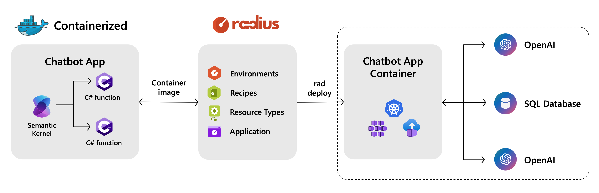

# Azure SQL Chat with your data - Insurance Sample

This is a simple example of a chatbot that uses Azure SQL to store and retrieve data using both RAG and Natural-Language-to-SQL (NL2QL) to allow chat on both structured and non-structured data. The bot is built using the Microsoft Semantic Kernel Framework and the newly added support for vectors in Azure SQL.

## See it in action!

You can see a recording of this demo here: https://www.youtube.com/live/1Idzjm05UmY?si=L5QFk3RpnpNZfzhV&t=1837

## Architecture


## Solution

The solution is composed of three main Azure components:

- [Azure SQL Database](https://learn.microsoft.com/en-us/azure/azure-sql/database/sql-database-paas-overview?view=azuresql): The database that stores the data.
- [Azure Open AI](https://learn.microsoft.com/azure/ai-services/openai/): The language model that generates the text and the embeddings.
- [Semantic Kernel](https://learn.microsoft.com/en-us/semantic-kernel/overview/): The library used to orchestrate calls to LLM to do RAG and NL2SQL and to store long-term memories in the database.

### Azure Open AI

Make sure to have two models deployed, one for generating embeddings (*text-embedding-3-small* model recommended) and one for handling the chat (*gpt-4 turbo* recommended). You can use the Azure OpenAI service to deploy the models. Make sure to have the endpoint and the API key ready. The two models are assumed to be deployed with the following names:

- Embedding model: `text-embedding-3-small`
- Chat model: `gpt-4`

### Configure environment 

Create a `.env` file starting from the `.env.sample` file:

- `CONNECTION_AICHAT_ENDPOINT`: the endpoint of your Azure OpenAI resource for chat
- `CONNECTION_AICHAT_APIKEY`: the API key of your Azure OpenAI resource for chat
- `CONNECTION_AIEMBEDDING_ENDPOINT`: the endpoint of your Azure OpenAI resource for embeddings
- `CONNECTION_AIEMBEDDING_APIKEY`: the API key of your Azure OpenAI resource for embeddings
- `CONNECTION_AIEMBEDDING_DEPLOYMENT`: the deployment name of the embedding model
- `CONNECTION_AICHAT_DEPLOYMENT`: the deployment name of the chat model

- `CONNECTION_SQLSERVERDB_CONNECTIONSTRING`: the connection string to the Azure SQL database where you want to deploy the database objects and sample data
- `MSSQL_TABLE_NAME`: the name of the table where the chatbot will store long-term memories

### Database

> [!NOTE]  
> The SQL Server engine support vector natively. Read everything about it here: [Announcing General Availability of Native Vector Type & Functions in Azure SQL](https://devblogs.microsoft.com/azure-sql/announcing-general-availability-of-native-vector-type-functions-in-azure-sql/)

To deploy the database, you can just use the `deploy` option of the chatbot application. Make sure you have created the `.env` file as explained in the previoud section, and then run the following command:

```bash
dotnet run deploy
```

That will connect to Azure SQL and deploy the needed database objects and some sample data.

## Application

To run the application, make sure you have created the `.env` file and deployed the database as explained in the previous section, and then run the following command:

```bash
dotnet run chat
```

The chatbot will start and you can start chatting with it. Use the `/ch` command to clear the chat history and `/h` to see the chat history. End the chat with `ctrl-c`.

The prompt will look like this:

```bash 
(H: 1) Question: 
```

`H` indicates the chat memory size. The chatbot will remember the last `H` interactions. 

You can now start to chat with your own data. Have fun!

## Deployment with Radius

[Radius](https://radapp.io) provides an automated way to deploy this application to Azure with all required infrastructure provisioned automatically. The custom Radius Resource Types in `./types/types.yaml` define the abstract AI Model and SQL Database resources that will be used by the application, while the IaC modules under `./recipes` will provision the concrete implementations of the required resources. Recipes and Azure details are tied together in the Radius Environment definition files under `./environments` that define the target deployment environments. The `app.bicep` file defines the application and its connected components and is used to deploy the app using Radius.



### Prerequisites

1. Kubernetes cluster(s) where the application will be deployed (AKS in this example), see the [Radius Kubernetes guide](https://docs.radapp.io/guides/operations/kubernetes/overview/#supported-kubernetes-clusters) for more guidance.
1. Radius installed and initialized on each cluster, see the [Radius quickstart](https://docs.radapp.io/quick-start/) for more details.
1. An Azure cloud provider configured for Radius in each of your AKS clusters, see the [Radius cloud providers guide](https://docs.radapp.io/guides/operations/providers/overview/) for instructions.

### Deploy the Application to AKS

1. Create and register the Radius Resource Types:
   ```bash
   rad resource-type create  --from-file ./types/types.yaml
   ```

1. Create a Radius Environment (if not already created):
   ```bash
   rad env create aks-dev
   ```

1. Deploy the Environment, being sure to pass in your Azure subscription and resource group as parameters:
   ```bash
   rad deploy ./environments/aks-dev.bicep --parameters subscriptionId=<subscriptionId> --parameters resourceGroupName=<resourceGroupName>
   ```

1. Deploy the Application:
   ```bash
   rad deploy app.bicep -e aks-dev -p chatModelName=gpt-4 -p embeddingModelName=text-embedding-3-small
   ```

   This command will:
   - Provision an Azure OpenAI instance with both chat and embedding models
   - Create an Azure SQL Database
   - Deploy the containerized chatbot application
   - Automatically configure all connections and environment variables

1. Exec into the chatbot container to start chatting:
   ```bash
   kubectl exec -n aks-dev-insurance-chat -it <chatbot-pod-name> -- /bin/sh -c "dotnet azure-sql-sk.dll chat"
   ```

   > You can find the `<chatbot-pod-name>` by running:
   >   ```bash
   >   kubectl get pods -n aks-dev-insurance-chat
   >   ```

### Clean Up

To remove all deployed resources:
```bash
rad app delete insurance-chat
```

## F.A.Q.

### How can I quickly generate the embeddings for my data already stored in Azure SQL?

Take a look at the Azure SQL Vectorizer repository: 

https://github.com/Azure-Samples/azure-sql-db-vectorizer

It does exactly what you are looking for.
